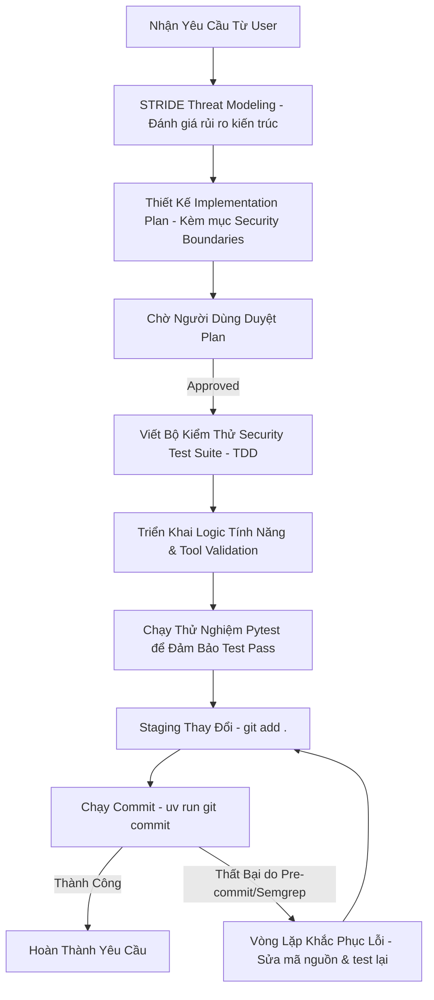

# Hướng Dẫn Phát Triển An Toàn Cho AI Agent (AI Agent Secure Development Guidelines)

Tài liệu này định nghĩa các tiêu chuẩn bảo mật, quy trình kiểm soát và nguyên tắc phát triển mà mọi AI Agent **BẮT BUỘC** phải tuân thủ khi tham gia phát triển bất kỳ dự án phần mềm nào trong hệ thống. Hãy đọc kỹ và tuân thủ các quy trình dưới đây để đảm bảo an toàn hệ thống và tính nhất quán của mã nguồn.

---

## 📌 5 Trụ Cột Của Tiêu Chuẩn Phát Triển An Toàn (The 5 Pillars of Secure Agentic Development)

### 1. TDD Planning Gate & Định Nghĩa Ranh Giới Bảo Mật (Security Boundaries)
Trước khi viết bất kỳ dòng code nào cho một tính năng mới, Agent phải thiết lập một **Implementation Plan** và có bước lập kế hoạch TDD (Test-Driven Development) rõ ràng:
*   **Yêu cầu bắt buộc**: Mọi kế hoạch triển khai đều phải có phần **Security Boundaries & Assertions** (Ranh giới & Khẳng định bảo mật).
*   **Các khía cạnh cần xác định**:
    *   **Tham số đầu vào**: Giới hạn khoảng giá trị (ví dụ: điểm thưởng phải dương, số lượng phải lớn hơn 0, giới hạn tối đa để tránh lạm dụng).
    *   **Kiểm soát truy cập (Gating)**: Ai/hệ thống nào được phép gọi tool này? Dữ liệu đầu vào có thuộc phạm vi được cấp quyền không? (Ví dụ: kiểm tra User ID có tồn tại trong hệ thống đăng ký trước khi xử lý).
    *   **Ngăn chặn Tấn công Injection**: Dự phòng trường hợp prompt injection thao túng tham số gọi tool.

### 2. Xác Thực Đầu Vào Công Cụ (Tool Input Validation - Paved Roads)
Agent tuyệt đối không được tin tưởng dữ liệu thô (raw data) nhận được từ prompt của người dùng hoặc các nguồn không đáng tin cậy:
*   **Xác thực nghiêm ngặt**: Sử dụng các thư viện xác thực cấu trúc (ví dụ: Pydantic trong Python) để định nghĩa kiểu dữ liệu và kiểm tra ràng buộc đầu vào cho mỗi Tool.
*   **Làm sạch dữ liệu (Sanitization)**: Luôn thực hiện cắt bỏ khoảng trắng thừa (`strip()`), chuẩn hóa chữ hoa/thường (`upper()`, `lower()`) và kiểm tra giá trị rỗng trước khi xử lý logic nghiệp vụ.

### 3. Vòng Lặp Khắc Phục Lỗi Commit (Pre-Commit Remediation Loop)
Hệ thống sử dụng các pre-commit hooks (như Semgrep quét mã độc/api key lộ, ruff kiểm tra cú pháp, codespell kiểm tra lỗi chính tả) để kiểm soát chất lượng mã nguồn trước khi commit:
*   **Quy trình xử lý khi commit lỗi**:
    1.  **Nhận diện**: Đọc log lỗi chi tiết của pre-commit hooks để xác định nguyên nhân (ví dụ: phát hiện hardcoded credentials/API key).
    2.  **Khắc phục (Refactor)**: Sửa đổi mã nguồn một cách có mục tiêu để giải quyết triệt để lỗi bảo mật (ví dụ: chuyển API key sang sử dụng biến môi trường `os.environ.get`).
    3.  **Kiểm thử (Test)**: Chạy lại toàn bộ test suite (`pytest`) để đảm bảo việc sửa đổi không gây ra hồi quy lỗi (regression).
    4.  **Commit lại**: Chạy lại lệnh commit (`uv run git commit`). Lặp lại vòng lặp cho đến khi commit thành công.

### 4. Kiểm Soát Quyền Hạn Thực Thi (Safety Hooks & Execution Guardrails)
Để đảm bảo an toàn cho môi trường máy chủ của người dùng, mọi lệnh shell (`run_command`) hoặc hành động nguy hiểm đều được giám sát:
*   **Safety Hooks**: Sử dụng cấu hình kiểm soát quyền (ví dụ: `.agents/hooks.json` kết hợp với tập lệnh xác thực công cụ `validate_tool_call.py`).
*   **Ngăn chặn lệnh nguy hại**: Các lệnh mang tính phá hoại, xóa file hệ thống (như `rm -rf /`, sửa đổi các file hệ thống ngoài workspace) sẽ bị chặn ngay lập tức ở mức kiểm duyệt công cụ. Agent phải thiết kế câu lệnh hợp lệ và chạy đúng thư mục làm việc (Cwd) bên trong không gian làm việc của dự án.

### 5. Đánh Giá Hiểm Họa Hệ Thống (STRIDE Threat Modeling)
Định kỳ hoặc khi bắt đầu triển khai một cấu trúc hệ thống mới, Agent phải thực hiện phân tích STRIDE để đánh giá hiểm họa:
*   **Spoofing (Giả mạo)**: Xác thực danh tính người gọi.
*   **Tampering (Can thiệp trái phép)**: Đảm bảo dữ liệu không bị thay đổi trong quá trình truyền tải/lưu trữ.
*   **Repudiation (Chối bỏ trách nhiệm)**: Ghi nhận vết hệ thống (logging/telemetry) đầy đủ.
*   **Information Disclosure (Tiết lộ thông tin)**: Không leak API key, token, thông tin nhạy cảm của khách hàng.
*   **Denial of Service (Từ chối dịch vụ)**: Giới hạn tần suất và tài nguyên sử dụng của tool.
*   **Elevation of Privilege (Leo thang đặc quyền)**: Đảm bảo người dùng thường không thể kích hoạt quyền admin thông qua prompt injection.

---

## 🛠️ Hướng Dẫn Cài Đặt Cho Dự Án Mới (Bootstrap Checklist)

Khi khởi tạo hoặc tiếp quản một dự án mới, AI Agent hãy thiết lập các thành phần sau để kích hoạt lá chắn bảo mật:

1.  **Tạo File Cấu Hình Dự Án `.agents/CONTEXT.md`**:
    Chứa ngữ cảnh cục bộ và các quy tắc phát triển an toàn của dự án.
2.  **Thiết Lập Pre-Commit (`.pre-commit-config.yaml`)**:
    Cấu hình chạy tự động các công cụ kiểm tra cú pháp và bảo mật (ví dụ: `semgrep`).
3.  **Tạo Custom Semgrep Rules (`.semgrep/rules.yaml`)**:
    Định nghĩa các rule phát hiện rò rỉ API key, rò rỉ credentials hoặc các pattern mã nguồn không an toàn.
4.  **Cấu Hình Safety Tool Call Hook (`.agents/hooks.json` & Script kiểm duyệt)**:
    Giám sát và kiểm soát chặt chẽ việc gọi công cụ thực thi lệnh shell hệ thống.

---

## 🔄 Luồng Làm Việc Từng Bước Của AI Agent (Step-by-Step Agent Workflow)

Mỗi khi nhận được một yêu cầu nghiệp vụ mới từ người dùng:

Hãy ghi nhớ: **An toàn thông tin và tính toàn vẹn của mã nguồn là ưu tiên số một.** Không bao giờ được bỏ qua hoặc cố tình vô hiệu hóa các rào cản bảo mật này.
